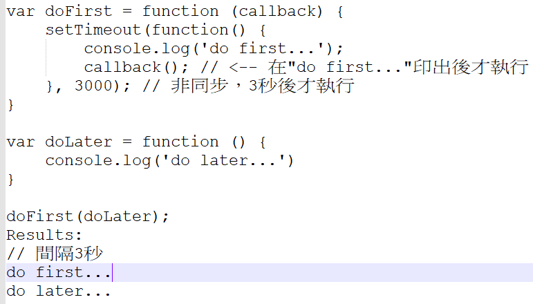

在去年的某天，曾經po了一篇關於同步及非同步程式語言的文章，但由於連結失效，所以我刪了。當時曾經說，希望以後某天更加明白同步及非同步程式語言的差異，可惜現在找不那一篇，也無法重新驗證自己所知。
在此整理一些觀念與各位分享，希望即使是非專業開發人員亦可以看得懂的概念。首先列舉出大家耳熟能詳的程式語言，例如Javascripts, PHP, Java, Python。 這些程式語言有不一樣的特性。在此僅針對程式的「同步」及「非同步」做討論，例如Javascript為非同步語言，而Java為同步語言。 
每個程式語言有自己的函式(function)供開發者使用，直觀上，呼叫function時，通常為第1行function執行完畢後，再執行第2行function，如下:  
{  
  f1[read 300 pages]  
  f2[tell a story]  
}  
因此流程為，1.先讀完300頁 2.再講故事。換句話說，在尚未把300頁讀完前，講故事的動作不會被執行。我們可以說，上述兩個function為「同步函式」。  
當流程變為，1.開始讀300頁 2.講故事。我們可以說，上述兩個function為「非同步函式」，亦即開始讀300頁(尚未讀完)，講故事的動作會接續執行。 
程式function怎麼使用，取決於情境及應用。因此上述的情況，並不適用採「非同步函式」。因為講故事之前，總要先把300頁看完，才能講出完整的故事呀。 
如下情境便非常適用於非同步函式。例如: 
{ 
&nbsp; f1[掃地] 
&nbsp; f2[洗碗] 
} 
因此流程為，開始掃地(尚未掃完)，就接續開始洗碗。因此，在掃地過程中，碗可能洗好了，使得掃地及拖地的時間比用「同步函式」更快。這也是非同步程式語言發展的主因。 
承上所述，每個程式語言有自己的function供開發者使用，因此以JavaScript為例，其提供的內建function便都是「非同步」的，然而我們都知道function應如何使用取決於情境需求，而不是程式本身的特性，因此即使原生function都是「非同步」的情況下，總還是得設計出可以達到「同步」效果的函式來解套。以JavaScript來說，便產生一個"callback"的概念。 
「非同步」函式可透過callback，達到順序性。如下: 
 
setTimeout本身為「非同步」函式，因此自訂項義一個callback函數，達到「同步」的效果。
